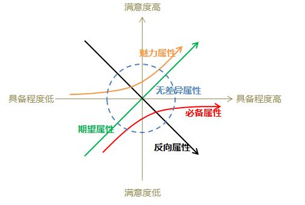

# 简介

KANO模型又叫狩野模式，是东京理工大学教授狩野纪昭(Noriaki Kano)发明的**对用户需求分类和优先排序**的有用工具，以分析用户需求对用户满意的影响为基础，体现了产品性能和用户满意之间的非线性关系。
<!-- more -->

在日常满意度应用中，都认为满意度是一维的，即某个产品（页面），提供更多功能、服务时用户就会感到满意，相反，当功能、服务不充足时，用户会感到不满。因此我们可能会不断在产品（页面）中添加新功能，通过这种方式提升用户的满意度。但是事实上会发现，并不是所有新增或优化的功能，都能提升用户的满意度，甚至有一些还会损害用户体验。满意度理论研究中发现，并非所有的因素对用户满意度产生的影响都是一维的，二维模式认为，当提供某些因素时，未必会获得用户的满意，有时可能会造成不满意，有时提供或不提供某些因素，用户认为根本无差异，这就是满意度的二维模式。

# 内容

根据不同类型的质量特性与顾客满意度之间的关系，狩野教授将产品服务的质量特性分为五类：
* 基本(必备)型需求 —— Must-beQuality/ Basic Quality：是顾客对企业提供的产品或服务因素的基本要求。是顾客认为产品“必须有”的属性或功能。当其特性不充足(不满足顾客需求)时，顾客很不满意；当其特性充足(满足顾客需求)时，顾客也可能不会因而表现出满意。对于基本型需求，即使超过了顾客的期望，但顾客充其量达到满意，不会对此表现出更多的好感。不过只要稍有一些疏忽，未达到顾客的期望，则顾客满意将一落千丈。例如对于空调来说，制冷功能就是基本型需求。不管成本多高都必须做。
* 期望（一元）型需求 —— One-dimensional Quality/ Performance Quality：是指顾客的满意状况与需求的满足程度成比例关系的需求，此类需求得到满足或表现良好的话，客户满意度会显著增加，企业提供的产品和服务水平超出顾客期望越多，顾客的满意状况越好。当此类需求得不到满足或表现不好的话，客户的不满也会显著增加。期望型需求没有基本型需求那样苛刻，要求提供的产品或服务比较优秀，但并不是“必须”的产品属性或服务行为有些期望型需求连顾客都不太清楚，但是是他们希望得到的，也叫用户需求的痒处。这是处于成长期的需求，客户、竞争对手和企业自身都关注的需求，也是体现竞争能力的需求。对于这类需求，企业的做法应该是注重提高这方面的质量，要力争超过竞争对手。在市场调查中，顾客谈论的通常是期望型需求。
* 兴奋（魅力）型需求 — Attractive Quality/ Excitement Quality：指不会被顾客过分期望的需求。对于魅力型需求，随着满足顾客期望程度的增加，顾客满意也急剧上升。但一旦得到满足，即使表现并不完善，顾客表现出的满意状况则也是非常高的。反之，即使在期望不满足时，顾客也不会因而表现出明显的不满意。是一款产品的亮点，没有的时候用户想不到，有了以后用户会赞不绝口。尽量挑选成本低的亮点功能来实现，不要费太大的功夫去做一个亮点，例如Mac的logo灯和呼吸灯。
* 无差异型需求 —— Indifferent Quality/Neutral Quality：不论提供与否，对用户体验无影响。是质量中既不好也不坏的方面，它们不会导致顾客满意或不满意。例如航空公司为乘客提供的没有实用价值的赠品。
* 反向（逆向）型需求 —— Reverse Quality：又称逆向型需求，指引起强烈不满的质量特性和导致低水平满意的质量特性，因为并非所有的消费者都有相似的喜好。许多用户根本都没有此需求，提供后用户满意度反而会下降，而且提供的程度与用户满意程度成反比。

常用的是前三种划分方式，关键词概括依次是基础，竞争力，亮点。依据的绩效指标分类是基本因素、绩效因素和激励因素。
基础功能只能消除不满，不能带来满意，亮点的重要性在于，有了，才有口碑传播的概念，没有亮点的产品，只会有人用，没有口碑。
没有一成不变的东西，尤其是新兴行业。一个功能所属的类别，随着时间会变，一般从亮点到期望到基本。例如手机的彩屏等，十几年前是亮点，现在是基本功能，这是人类创新、进步的正常过程。

# 目的
严格的说，该模型不是一个测量顾客满意度的模型，而是对顾客需求或者说对绩效指标的分类，通常在满意度评价工作前期作为辅助研究模型，KANO模型的目的是通过对顾客的不同需求进行区分处理，帮助企业找出提高企业顾客满意度的切入点。KANO模型是一个典型的定性分析模型，一般不直接用来测量顾客的满意度，它常用于对绩效指标进行分类，帮助企业了解不同层次的顾客需求，找出顾客和企业的接触点，识别使顾客满意的至关重要的因素。

# 实际意义

实际中，企业首先要全力以赴地满足顾客的基本型需求，保证顾客提出的问题得到认真的解决，重视顾客认为企业有义务做到的事情，尽量为顾客提供方便。以实现顾客最基本的需求满足。然后，企业应尽力去满足顾客的期望型需求，这是质量的竞争性因素。提供顾客喜爱的额外服务或产品功能，使其产品和服务优于竞争对手并有所不同，引导顾客加强对本企业的良好印象，使顾客达到满意。最后争取实现顾客的兴奋型需求，为企业建立最忠实地客户群。

# KANO模型分析方法

KANO模型分析方法是根据狩野纪昭设计的结构型问卷来收集用户调查信息并进行相关分析，详见参考资料链接

 参考资料链接

http://wiki.mbalib.com/zh-tw/KANO模型

 用KANO模型来反思、指导工作

* 基础需求：输出需求文档；保证产品质量
* 期望需求：管理需求；分析竞品；
* 兴奋需求：通过文档提高内部沟通和效率；发掘客户新需求；
* 无差异需求：反复检查校准文档
* 反向需求：别人咨询产品问题时不能很好的解答
不要将时间耗在无差异需求和反向需求上面，切记满足于做基本需求，这样也会花费大量时间而收获很少，学会去挖掘兴奋需求并努力去做，这样才能更快成长，也能取得更好的成果。
